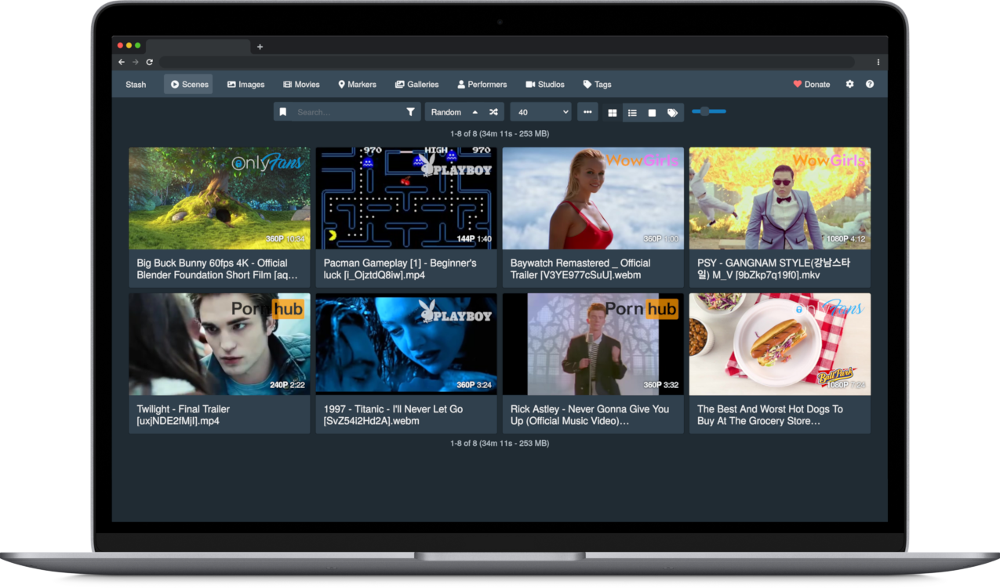
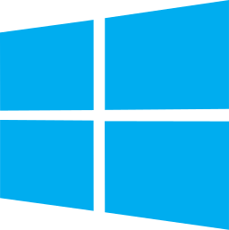
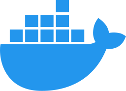

# Stash

### **Stash is a self-hosted webapp written in Go which organizes and serves your diverse content collection, catering to both your SFW and NSFW needs.**

* Stash gathers information about videos in your collection from the internet, and is extensible through the use of community-built plugins for a large number of content producers and sites.
* Stash supports a wide variety of both video and image formats.
* You can tag videos and find them later.
* Stash provides statistics about performers, tags, studios and more.

You can [watch a SFW demo video](https://vimeo.com/545323354) to see it in action.

For further information you can consult the [documentation](https://docs.stashapp.cc) or access the in-app manual from within the application (also available at [docs.stashapp.cc/in-app-manual](https://docs.stashapp.cc/in-app-manual)).

# Installing Stash

Step-by-step instructions are available at [docs.stashapp.cc/installation](https://docs.stashapp.cc/installation/).

#### Windows Users:

As of version 0.27.0, Stash no longer supports _Windows 7, 8, Server 2008 and Server 2012._  
At least Windows 10 or Server 2016 is required.

#### Mac Users:

As of version 0.29.0, Stash requires _macOS 11 Big Sur_ or later.  
Stash can still be run through docker on older versions of macOS.

 Windows |  macOS |  Linux |  Docker
:---:|:---:|:---:|:---:
[Latest Release](https://github.com/stashapp/stash/releases/latest/download/stash-win.exe)   [Development Preview](https://github.com/stashapp/stash/releases/download/latest_develop/stash-win.exe) | [Latest Release](https://github.com/stashapp/stash/releases/latest/download/Stash.app.zip)   [Development Preview](https://github.com/stashapp/stash/releases/download/latest_develop/Stash.app.zip) | [Latest Release (amd64)](https://github.com/stashapp/stash/releases/latest/download/stash-linux)   [Development Preview (amd64)](https://github.com/stashapp/stash/releases/download/latest_develop/stash-linux)   [More Architectures...](https://github.com/stashapp/stash/releases/latest) | [Instructions](docker/production/README.md)   [Sample docker-compose.yml](docker/production/docker-compose.yml)

Download links for other platforms and architectures are available on the [Releases](https://github.com/stashapp/stash/releases) page.

## First Run

#### Windows/macOS Users: Security Prompt

On Windows or macOS, running the app might present a security prompt since the application binary isn't yet signed. 

- On Windows, bypass this by clicking "more info" and then the "run anyway" button.
- On macOS, Control+Click the app, click "Open", and then "Open" again.

#### ffmpeg

Stash requires FFmpeg. If you don't have it installed, Stash will prompt you to download a copy during setup. It is recommended that Linux users install `ffmpeg` from their distro's package manager.

# Usage

## Quickstart Guide

Stash is a web-based application. Once the application is running, the interface is available (by default) from `http://localhost:9999`.

On first run, Stash will prompt you for some configuration options and media directories to index, called "Scanning" in Stash. After scanning, your media will be available for browsing, curating, editing, and tagging.

Stash can pull metadata (performers, tags, descriptions, studios, and more) directly from many sites through the use of [scrapers](https://github.com/stashapp/stash/blob/develop/ui/v2.5/src/docs/en/Manual/Scraping.md), which integrate directly into Stash. Identifying an entire collection will typically require a mix of multiple sources:
- The stashapp team maintains [StashDB](https://stashdb.org/), a crowd-sourced repository of scene, studio, and performer information. Connecting it to Stash will allow you to automatically identify much of a typical media collection. It runs on our stash-box software and is primarily focused on mainstream digital scenes and studios. Instructions, invite codes, and more can be found in this guide to [Accessing StashDB](https://guidelines.stashdb.org/docs/faq_getting-started/stashdb/accessing-stashdb/).
- Several community-managed stash-box databases can also be connected to Stash in a similar manner. Each one serves a slightly different niche and follows their own methodology. A rundown of each stash-box, their differences, and the information you need to sign up can be found in this guide to [Accessing Stash-Boxes](https://guidelines.stashdb.org/docs/faq_getting-started/stashdb/accessing-stash-boxes/).
- Many community-maintained scrapers can also be downloaded, installed, and updated from within Stash, allowing you to pull data from a wide range of other websites and databases. They can be found by navigating to `Settings → Metadata Providers → Available Scrapers → Community (stable)`. These can be trickier to use than a stash-box because every scraper works a little differently. For more information, please visit the [CommunityScrapers repository](https://github.com/stashapp/CommunityScrapers).
- All of the above methods of scraping data into Stash are also covered in more detail in our [Guide to Scraping](https://docs.stashapp.cc/beginner-guides/guide-to-scraping/).

[StashDB](http://stashdb.org) is the canonical instance of our open source metadata API, [stash-box](https://github.com/stashapp/stash-box).

# Translation

Stash is available in 32 languages (so far!) and it could be in your language too. We use Weblate to coordinate community translations. If you want to help us translate Stash, you can make an account at [Codeberg's Weblate](https://translate.codeberg.org/projects/stash/stash/) to contribute to new or existing languages. Thanks!

The badge below shows the current translation status of Stash across all supported languages:

# Support & Resources

Need help or want to get involved? Start with the documentation, then reach out to the community if you need further assistance.

- Documentation
  - Official docs: https://docs.stashapp.cc - official guides guides and troubleshooting.
  - In-app manual: press <kbd>Shift</kbd> + <kbd>?</kbd> in the app or view the manual online: https://docs.stashapp.cc/in-app-manual.
  - FAQ: https://discourse.stashapp.cc/c/support/faq/28 - common questions and answers.
  - Community wiki: https://discourse.stashapp.cc/tags/c/community-wiki/22/stash - guides, how-to’s and tips.
  
- Community & discussion
  - Community forum: https://discourse.stashapp.cc - community support, feature requests and discussions.
  - Discord: https://discord.gg/2TsNFKt - real-time chat and community support.
  - GitHub discussions: https://github.com/stashapp/stash/discussions - community support and feature discussions.
  - Lemmy community: https://discuss.online/c/stashapp - Reddit-style community space.

- Community scrapers & plugins
  - Metadata sources: https://docs.stashapp.cc/metadata-sources/
  - Plugins: https://docs.stashapp.cc/plugins/
  - Themes: https://docs.stashapp.cc/themes/
  - Other projects: https://docs.stashapp.cc/other-projects/

# For Developers

Pull requests are welcome! 

See [Development](docs/DEVELOPMENT.md) and [Contributing](docs/CONTRIBUTING.md) for information on working with the codebase, getting a local development setup, and contributing changes.
