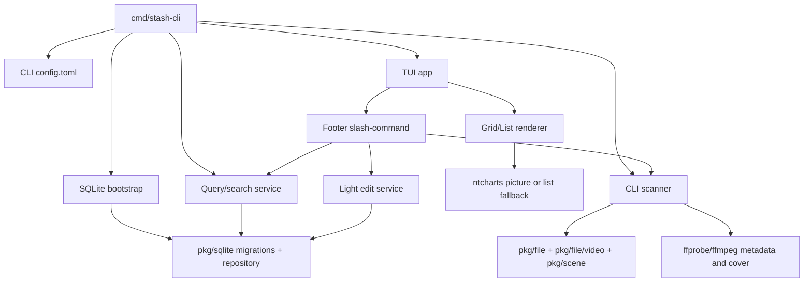

# feat: 添加本地 Stash CLI TUI

## Summary

本计划覆盖需求文档中的第一阶段范围：构建一个不启动 Stash server、不访问 HTTP/GraphQL API 的本地交互式终端版 Stash。CLI 可以打开已有 Stash SQLite 数据库，也可以基于配置目录创建并扫描本地数据库；远程媒体通过已经挂载到本机的路径访问。

实现策略是复用 Stash 现有 SQLite schema、migrations、repository、文件扫描和 ffmpeg 能力，同时新增一个独立 CLI/TUI 应用层。第一版以浏览、搜索、封面网格、列表降级、底部 slash-command、启动扫描和轻量 scene 编辑为核心，不纳入内置 SSH/SFTP、完整元数据管理、scraper、文件删除/移动或终端内视频播放。

## Requirements

- P-R1. 新增 CLI 必须独立运行，不启动 Web server，也不调用 Stash HTTP 或 GraphQL API。
- P-R2. CLI 必须支持自己的 `config.toml`，读取数据库路径、媒体目录、启动扫描、展示字段、图形模式和缓存目录。
- P-R3. CLI 必须能打开兼容的现有数据库，或使用现有 migrations 初始化新数据库。
- P-R4. CLI 启动扫描必须能索引配置中的本地或已挂载远程目录，写入可浏览的视频记录和基础元数据。
- P-R5. CLI 必须支持按名称、tag、performer/actress 搜索，并在交互式视图中刷新结果。
- P-R6. CLI 默认提供封面网格；终端图形能力不可用或用户配置为 list-only 时必须稳定降级为列表。
- P-R7. TUI 底部必须有持久 slash-command 输入栏，命令错误必须可恢复并显示在界面内。
- P-R8. 第一版写入只覆盖 favorite、watched、rating、organized、title、date 等轻量字段，并在写入前做数据库安全检查。
- P-R9. 所有新增用户文档、示例配置和命令说明使用中文。

## High-Level Design

新增 `stash-cli` 作为独立二进制，避免复用 `cmd/stash` 的 server 初始化路径。CLI 层拥有自己的配置加载、数据库 bootstrap、扫描服务、查询服务、封面服务和 TUI 状态模型。

数据库层优先使用 `pkg/sqlite.NewDatabase().Open()` 及其 embedded migrations。查询和写入通过 `models.Repository` 的 read/write transaction 执行，避免直接拼接散落 SQL；必要的聚合查询可以先封装在 CLI 内部 repository adapter 中。

扫描层不直接启动 `internal/manager` 全局单例。第一版用一个轻量 scanner 复用 `pkg/file.Scanner`、`pkg/file/video.Decorator` 和 `pkg/scene.ScanHandler` 的低层能力，配置最小的视频扩展、root paths、ffprobe 和 cover 生成。Web scanner 的 gallery/image/zip/scraper parity 保持在范围外。

TUI 层采用 Bubble Tea 风格状态机。封面网格通过一个 `CoverRenderer` 接口隔离终端图形实现：Kitty graphics 可用时使用 ntcharts `picture` 能力渲染合成网格，不可用时使用文本列表。Footer prompt 始终存在，slash-command 解析后派发到搜索、扫描、视图切换或轻量编辑服务。

## Key Technical Decisions

- 使用独立 `cmd/stash-cli`，降低对现有 server 入口、pflag 和 desktop 集成的影响。
- CLI 配置独立于现有 Stash `config.yml`。只读取 CLI 需要的路径、字段和偏好，避免意外改写 Web server 配置。
- 新数据库初始化复用现有 migrations，不创建第二套“类 Stash”schema。
- 远程媒体只接受本地挂载路径。CLI 不管理 SSH 凭据，也不内置 SFTP 文件系统。
- 封面优先读数据库中的 scene cover；缺失时可用 ffmpeg 生成，并按配置决定写回 DB 或写入 CLI 缓存。
- 写入操作默认保守：检测到 SQLite busy、schema 不匹配或疑似 server 并发使用时，阻止写入并提示用户停止 Stash server。

## Implementation Units

### U1. CLI 入口与配置

新增 `cmd/stash-cli` 和内部 CLI 包，提供 `stash-cli --config <path>`、默认配置查找、配置校验和示例配置生成。配置字段包括 `database_path`、`media_dirs`、`scan_on_startup`、`display_fields`、`graphics_mode`、`cache_dir`、`ffmpeg_path` 和 `ffprobe_path`。

验收：无配置时给出清晰错误或初始化提示；有效配置能打印解析后的运行摘要；配置测试覆盖缺失路径、无效字段和默认值。

### U2. 数据库 Bootstrap

实现 CLI 专用数据库打开流程：创建 `sqlite.Database`，打开现有库或初始化新库，处理 migration-needed、schema-too-new、不可读路径和锁定错误。暴露一个 CLI repository provider，供查询、扫描和编辑共享事务入口。

验收：临时目录中可创建新库；已有兼容库可只读查询；schema mismatch 会阻止启动并显示原因。

### U3. 启动扫描与索引

实现最小视频扫描 pipeline。扫描配置目录，过滤常见视频扩展，写入 folder/file/video_file/scene 关系，使用 ffprobe 填充 duration、format、codec、尺寸等可得元数据。路径为挂载远程目录时按普通本地路径处理。

验收：给定测试媒体目录，启动扫描后数据库中出现可浏览 scene；重复扫描不会重复创建记录；不可读文件记录为可恢复错误。

### U4. 封面服务与缓存

实现 cover loader：先读 scene cover blob，缺失时尝试生成缩略图。生成结果可配置为写回数据库或写入 CLI cache，缓存必须位于媒体目录之外。封面服务输出适合 TUI 渲染的 image 或临时文件引用。

验收：已有 cover 的 scene 不触发 ffmpeg；缺失 cover 的可读视频能生成封面；生成失败不影响列表浏览。

### U5. 查询、搜索与展示模型

实现 browse query service，返回 TUI 所需的 scene item：id、title/name、duration、date、path、rating、organized、watched/favorite 状态和 cover 引用。搜索支持普通文本、tag、performer/actress 条件，初始可通过 slash-command 语法表达。

验收：按名称、tag、performer 过滤能返回正确结果；分页/limit 可用于大库；展示字段按配置排序。

### U6. TUI Shell、网格与列表

实现交互式 TUI：alt-screen、窗口 resize、键盘导航、网格/列表切换、详情面板、状态栏和 footer prompt。图片渲染层通过能力检测选择 Kitty graphics 或列表/文本 fallback，并提供手动 `list-only` 模式。

验收：Kitty 中显示封面网格；不支持图形或配置 list-only 时显示稳定列表；resize 不破坏布局；错误信息不退出程序。

### U7. Slash-Command 系统

实现 footer command parser、help/completion 和命令派发。首批命令包括 `/search`、`/clear`、`/scan`、`/view grid|list`、`/open`、`/edit`、`/help`、`/quit`。命令执行结果写入 TUI 状态，不直接 panic 或退出。

验收：未知命令显示可恢复错误；help 能列出可用命令；搜索和扫描命令能更新当前视图。

### U8. 轻量编辑与写入安全

实现 scene 轻量字段更新服务，使用 repository transaction 和 `ScenePartial` 更新 title、date、rating、organized，以及 watched/favorite 映射字段。写入前执行 DB 可写性检查，并对 SQLite busy/server 冲突给出明确错误。

验收：选中 scene 可编辑轻量字段并刷新视图；server 占用或 DB locked 时阻止写入；tag/performer/studio 修改命令明确提示暂不支持。

### U9. 测试、文档与开发命令

补充 Go 单元测试和必要集成测试 fixture。新增中文 CLI 使用文档、示例配置和开发说明。将关键命令接入 Makefile 或文档化为 `go test`/`go run` 路径。

验收：`go test ./cmd/stash-cli ./internal/...` 覆盖 CLI 新包；与 sqlite/scan 相关测试使用临时目录和 fixture；文档包含 Kitty、list-only、挂载远程目录和停止 server 的说明。

## Testing Strategy

- 配置层：表驱动测试覆盖默认值、无效字段、路径展开和 list-only 模式。
- 数据库层：临时 SQLite 文件测试打开、初始化、migration error 和 locked DB 错误分类。
- 扫描层：小型视频 fixture 或可替代 mock ffprobe，验证不重复索引、duration 写入和错误恢复。
- 查询层：构造 tag、performer、scene fixture，验证搜索过滤和分页。
- TUI 层：优先测试 command parser、state reducer、renderer mode selection；终端图形行为用手动验证记录。
- 回归命令：运行 `go test ./cmd/stash-cli ./internal/... ./pkg/sqlite ./pkg/file ./pkg/scene`，必要时再运行 `make it`。

## Manual Verification

1. 在 Kitty 中使用已有数据库启动 CLI，确认默认进入封面网格。
2. 设置 `graphics_mode = "list-only"` 后启动，确认进入纯列表。
3. 使用空临时数据库和一个本地媒体目录启动，确认扫描后出现 scene。
4. 将远程服务器目录通过 `sshfs` 挂载到本机，把挂载路径写入配置，确认扫描和浏览表现与本地目录一致。
5. 运行 `/search`、`/clear`、`/view list`、`/view grid`、`/help`，确认 footer 错误可恢复。
6. 停止 Stash server 后编辑 title/rating/date；再模拟 DB busy，确认写入被阻止。

## Risks And Mitigations

- Stash scanner 与 manager 耦合较深。缓解：第一版只复用低层 scanner/scene/video 能力，避免拉起 manager 单例。
- Kitty graphics 在不同终端、tmux 和 resize 下可能不稳定。缓解：渲染层可插拔，默认有 list fallback，并保留手动 override。
- 直接写 SQLite 有并发风险。缓解：所有写入集中在 edit service，明确处理 locked/busy，并要求用户停止 server。
- ffmpeg 对远程挂载路径可能较慢。缓解：扫描和 cover 生成可配置关闭，UI 中显示进度和可恢复错误。
- 新依赖可能影响主应用构建。缓解：依赖集中在 CLI/TUI 包，先跑目标包测试，再跑现有验证命令。

## Scope Boundaries

第一版不实现内置 SSH/SFTP backend、完整 Web scanner parity、tag/performer/studio 管理、scraper/stash-box、文件删除/移动、后台服务模式或终端内视频播放。CLI 也不替代现有 Web UI；它是本地、键盘驱动、面向快速浏览和轻量编辑的补充入口。

## Open Questions

- `watched` 和 `favorite` 在现有 schema 中的最终映射需要实施时确认，并以最小写入面实现。
- 封面缺失时默认写回 DB 还是只写 CLI cache，需要在实现前结合用户偏好和数据库兼容性再定。
- ntcharts 依赖使用上游版本还是本地 replace，需要在引入依赖时按当前 Go module 可用性确认。
